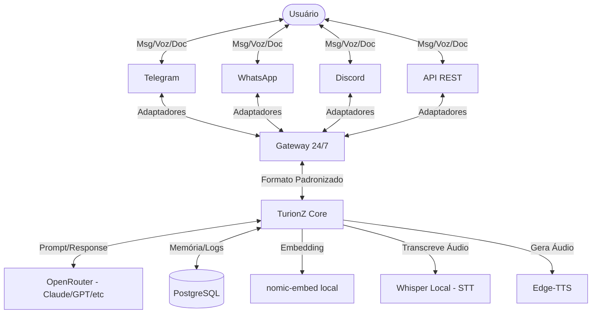
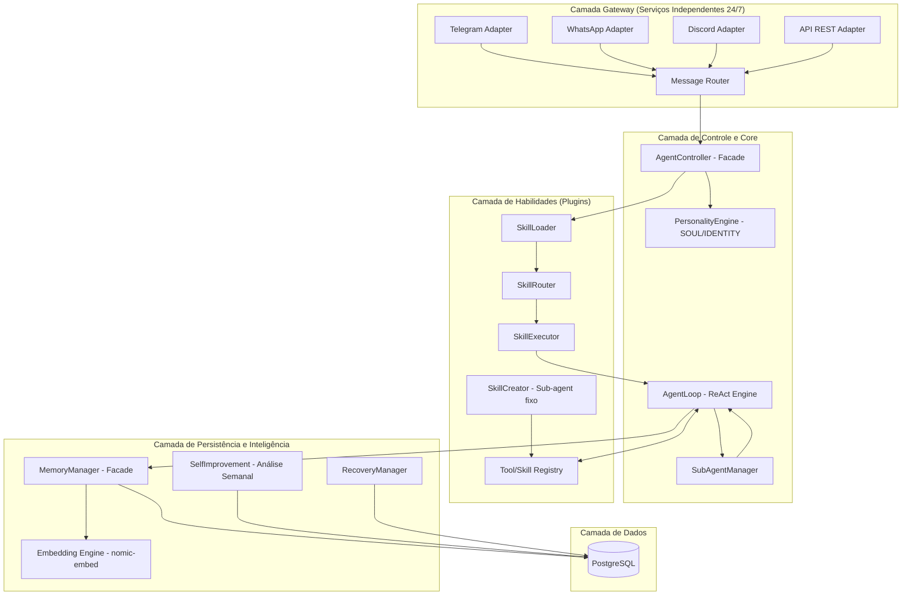
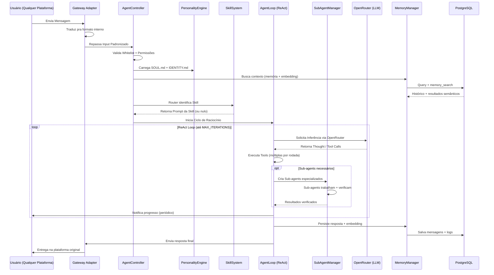

# Arquitetura do Projeto: TurionZ

**Versão:** 2.0
**Status:** Aprovada
**Created by:** BollaNetwork
**Data:** 2026-03-24

---

## 2.1 Visão Geral

O **TurionZ** é um agente pessoal de IA criado pela **Bolla Network**, projetado para operar localmente na máquina do usuário (Linux, Windows, Mac). Sua interface é multi-plataforma (Telegram, WhatsApp, Discord, API REST) através de um Gateway 24/7.

O sistema é modular, extensível através de Skills (com hot-reload), possui personalidade própria (SOUL.md), cria sub-agents especializados ilimitados, aprende com erros semanalmente, e se recupera automaticamente de falhas.

---

## 2.2 Requisitos Arquiteturais

| Requisito | Tipo | Prioridade | Notas |
|-----------|------|------------|-------|
| Operação Local | Não-funcional | Crítica | Core roda no host local (Linux/Windows/Mac). |
| Multi-Plataforma | Funcional | Alta | Gateway 24/7: Telegram, WhatsApp, Discord, API REST. |
| Persistência | Funcional | Alta | PostgreSQL + embedding via nomic-embed local. |
| Padronização de LLMs | Não-funcional | Alta | Troca dinâmica via OpenRouter com catálogo mensal. |
| Sub-Agents | Funcional | Alta | Ilimitados, com até 3 sub-sub-agents cada, verificador obrigatório. |
| Personalidade | Funcional | Alta | Sistema SOUL.md + IDENTITY.md + MEMORY.md. |
| Self-Improvement | Funcional | Média | Auto-análise semanal com verificação de mudanças. |
| Recuperação | Não-funcional | Alta | Auto-start no boot, retoma de onde parou. |
| Segurança | Funcional | Crítica | Whitelist + sistema de permissões "pede uma vez". |

---

## 2.3 Estilo Arquitetural

O sistema adota um estilo **Monolito Modular com Arquitetura de Serviços Independentes**.

- **Monolito Modular:** O core (Agent Loop, Skills, Memory) roda como processo único para simplicidade.
- **Serviços Independentes:** O Gateway e cada adaptador de plataforma rodam como serviços separados — se um cair, os outros continuam.
- **Plugin-based (Skills):** Skills são adicionadas via hot-reload manipulando diretórios, sem reiniciar o core.

**Trade-offs:**
- **Vantagem:** Baixa latência interna, facilidade de manutenção, isolamento de falhas nos adaptadores.
- **Desvantagem:** Escalabilidade limitada ao hardware local (aceitável para agente pessoal).

---

## 2.4 Diagrama de Contexto



---

## 2.5 Diagrama de Componentes e Camadas



---

## 2.6 Estrutura de Serviços

```
turionz/
├── services/
│   ├── gateway/
│   │   ├── telegram-adapter/      # Escuta Telegram 24/7
│   │   ├── whatsapp-adapter/      # Escuta WhatsApp 24/7
│   │   ├── discord-adapter/       # Escuta Discord 24/7
│   │   ├── api-adapter/           # Escuta HTTP REST 24/7
│   │   └── message-router/        # Traduz e encaminha pro Core
│   ├── core/
│   │   ├── agent-loop/            # Motor de raciocínio ReAct
│   │   ├── personality/           # SOUL.md + IDENTITY.md engine
│   │   ├── skill-system/          # Loader + Router + Executor
│   │   ├── sub-agent-manager/     # Criação e gerência de sub-agents
│   │   ├── memory/                # PostgreSQL + embedding
│   │   └── permissions/           # Sistema "pede uma vez"
│   └── infra/
│       ├── logger/                # Logs da Bolla Network
│       ├── recovery/              # Auto-start e recuperação
│       └── self-improvement/      # Análise semanal
├── .agents/
│   ├── SOUL.md                    # Personalidade do TurionZ
│   ├── IDENTITY.md                # Identidade externa
│   ├── MEMORY.md                  # Memória persistente de lições
│   └── skills/                    # Plugins de habilidades
│       ├── skill-creator/         # Sub-agent fixo criador de skills
│       └── .../                   # Skills dinâmicas
├── data/
│   └── embeddings/                # Cache local de embeddings
└── tmp/                           # Arquivos temporários
```

---

## 2.7 Decisões de Tecnologia (Source of Truth)

| Componente | Tecnologia | Justificativa |
|------------|------------|---------------|
| **Linguagem** | **Node.js (TypeScript)** | Ecossistema rico para IO, compatível multi-plataforma. |
| **Paradigma** | **Orientação a Objetos** | Classes, Interfaces e Padrões de Projeto. |
| **Banco de Dados** | **PostgreSQL** | Robusto, suporta pgvector para embeddings. |
| **Embedding** | **nomic-embed (local)** | Roda em CPU, sem custo, independente do core. |
| **LLM Provider** | **OpenRouter** | Acesso a Claude, GPT e dezenas de modelos por uma API. |
| **Gateway Telegram** | **grammy** | Framework moderno para Telegram Bot API. |
| **Gateway WhatsApp** | **whatsapp-web.js** ou **Baileys** | Conexão direta sem API paga. |
| **Gateway Discord** | **discord.js** | Biblioteca oficial do Discord. |
| **Raciocínio IA** | **ReAct Pattern** | Loop de Thought → Action → Observation → Answer. |
| **STT (Voz)** | **Whisper (Local)** | Transcrição privada em CPU, PT-BR. |
| **TTS (Fala)** | **Edge-TTS** | Voz de alta qualidade (pt-BR-ThalitaMultilingualNeural). |
| **Skills Tools** | **TypeScript / Python / Qualquer** | Cada skill usa a melhor linguagem pra sua função. |
| **Plataforma** | **Linux / Windows / Mac** | Compatibilidade total. |

---

## 2.8 Design Patterns Utilizados

1. **Facade:** AgentController e MemoryManager simplificam interface com subsistemas.
2. **Factory:** ProviderFactory pra LLMs, ToolFactory pra ferramentas.
3. **Repository:** Abstração do acesso ao PostgreSQL.
4. **Singleton:** Instância única da conexão com o banco.
5. **Strategy:** OutputHandler decide entre texto, chunks, arquivo ou áudio.
6. **Registry:** Skills e Tools com registro dinâmico.
7. **Adapter:** Cada plataforma do Gateway tem seu adaptador que traduz pra formato interno.
8. **Observer:** Sistema de notificações de progresso pra tarefas longas.
9. **Chain of Responsibility:** Pipeline de processamento de mensagem (whitelist → router → executor → loop).

---

## 2.9 Fluxo Crítico (Sequence Diagram)



---

## 2.10 Hierarquia de Agents

```
TurionZ (Agente Principal — Diretor)
├── Escolhe modelo ideal via OpenRouter por tarefa
├── Possui personalidade (SOUL.md)
├── Cria sub-agents ilimitados
│
├── Sub-agent A (Gerente — herda configs do TurionZ)
│   ├── Sub-sub-agent A1 (mesmo modelo do pai)
│   ├── Sub-sub-agent A2 (mesmo modelo do pai)
│   └── Sub-sub-agent A3 (máximo 3 — um é verificador)
│
├── Sub-agent B (Gerente — herda configs do TurionZ)
│   └── Sub-sub-agent B1 (verificador obrigatório)
│
└── Sub-agent Fixo: SkillCreator
    └── Cria, testa e instala novas skills automaticamente
```

**Regras:**
- Sub-agents herdam configs do TurionZ (não podem mudar).
- Sub-sub-agents herdam configs do sub-agent pai.
- Máximo 3 sub-sub-agents por sub-agent.
- Cada sub-agent obrigatoriamente spawna pelo menos 1 verificador.
- Sub-agents podem se comunicar entre si e esperar uns pelos outros.

---

## 2.11 Infraestrutura e Deploy

- **Ambiente:** Execução local em Linux / Windows / Mac.
- **Auto-start:** Inicia com o sistema operacional.
- **Recovery:** Ao iniciar, verifica estado no PostgreSQL e retoma de onde parou.
- **Serviços:** Gateway e adaptadores rodam como processos independentes.
- **Diretórios de Dados:**
    - PostgreSQL: banco principal (conversas, logs, modelos, lições).
    - `./data/embeddings/`: Cache local de embeddings nomic-embed.
    - `./tmp/`: Arquivos temporários (PDFs, áudios) deletados após uso.
    - `.agents/skills/`: Plugins de habilidades com hot-reload.
    - `.agents/SOUL.md`: Personalidade do TurionZ.

---

## 2.12 Riscos e Mitigações

| Risco | Impacto | Mitigação |
|-------|---------|-----------|
| Falha no PostgreSQL | Alto | WAL ativo, recovery automático, backups periódicos. |
| Falha na API de LLM | Alto | Retry com backoff (1s→3s→6s). OpenRouter permite fallback entre modelos. |
| Vazamento de Memória (Node) | Médio | Gerenciamento de buffers, limpeza de TMP, monitoramento. |
| Estouro de Contexto | Médio | Janela de 150k tokens com resumo automático e memory_search. |
| Gateway de plataforma cai | Médio | Serviços independentes — só a plataforma afetada para. |
| Sub-agents descontrolados | Médio | Limite de 3 sub-sub-agents. Verificador obrigatório. |
| Queda de energia | Alto | Auto-start + recovery do estado do PostgreSQL. |
